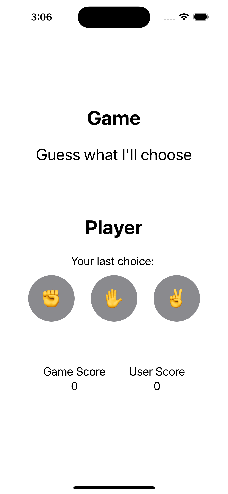
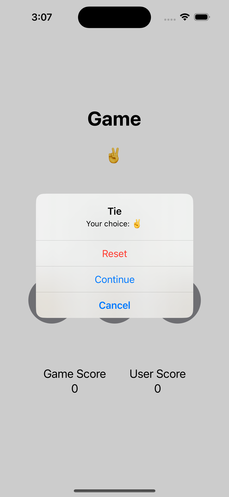

# RockPaperScissors
Simple **Rock Paper Scissors** game made with SwiftUI

## Screenshots

* This is the main screen of this app.
* Three buttons which represents Rock, Paper, Scissors
* Tapping the button will start the game

* Alert showing I won
  

* Alert showing I tied
  

* Alert showing I lost

### To-dos (No ETA)
- Add animation to the button when tapped (pop as an example)
- Better UI for the score 
- Different color for higher score
